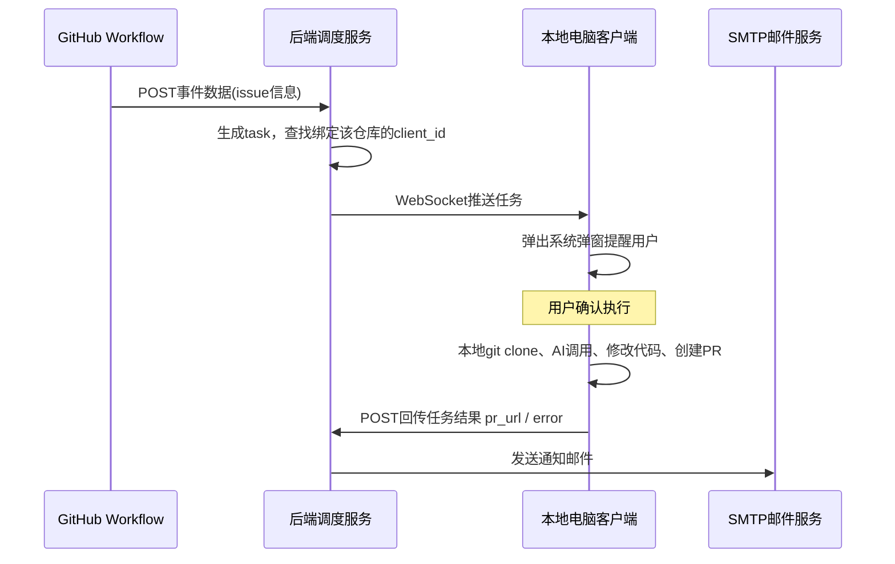

# 目标架构梳理
你的核心诉求：**GitHub Actions只做事件转发，真正的git/AI处理不在GitHub Runner，而是跑在你自己绑定的客户端电脑上**，后端作为中间调度层。

完整数据流：
```
GitHub(Workflow)
     ↓（http POST，携带事件信息：仓库、issue编号、触发行为、关键词）
你的后端服务（调度中心）
     ↓（下发任务：推送到绑定的目标客户端电脑）
你的客户端程序（跑在你本地电脑后台，常驻进程，Windows/Linux/macOS）
     ├─ 弹窗/托盘提醒用户收到任务
     ├─ 本地执行git clone/checkout/分支创建
     ├─ 调用AI做代码修改
     ├─ 本地git commit push，调用GitHub API创建PR
     ↓（把PR结果、错误信息回传给后端）
后端
     └─ 发送邮件通知给相关人员（成功/失败、PR链接）
```

> 关键点区分：
1. GitHub Workflow **不再执行git、AI**，只负责把事件数据上报给你的后端；
2. 真正重活全部跑在**你自己的电脑客户端**，不是GitHub云端；
3. 后端只做：任务存储、任务下发、客户端绑定管理、结果接收、发邮件；
4. 客户端常驻后台，可以弹窗提醒，可拒绝执行任务。

## 组件拆分（4大模块）
### ① GitHub Workflow（极简，只上报事件）
`.github/workflows/report‑event.yml`
> 职责：issue触发，把事件元数据POST到你的后端接口，**不在runner做任何git/AI**。
```yaml
name: Report issue event to my backend
on:
  issues:
    types: [opened]

permissions:
  issues: read

jobs:
  forward_event:
    runs-on: ubuntu-latest
    steps:
      - name: Post event to my backend
        uses: fjogeleit/http-request-action@v1
        with:
          url: ${{ secrets.BACKEND_WEBHOOK_URL }}
          method: POST
          contentType: application/json
          bearerToken: ${{ secrets.BACKEND_WEBHOOK_SECRET }}
          data: >
            {
              "event_type":"issue_opened",
              "repo_full_name":"${{ github.repository }}",
              "issue_number":${{ github.event.issue.number }},
              "issue_title":"${{ github.event.issue.title }}",
              "issue_body":"${{ github.event.issue.body }}",
              "trigger_keyword":"",
              "repository_id":"${{ github.repository_id }}"
            }
```
仓库Secrets配置：
- `BACKEND_WEBHOOK_URL`：你的后端公网接口地址
- `BACKEND_WEBHOOK_SECRET`：签名密钥，防止伪造请求

---

### ② 后端调度服务（核心中间层）
能力清单：
1. 接收GitHub workflow上报的http事件，校验签名
2. **客户端绑定管理**：多个客户端注册，每个客户端有唯一client_id，绑定对应仓库
3. 任务队列：收到事件生成任务，下发给对应绑定的客户端
4. 接收客户端回传的执行结果（pr链接、报错）
5. 邮件发送模块（smtp），通知用户结果
6. API接口：客户端长轮询 / WebSocket 获取任务

> 两种下发任务方案二选一
- 方案1：**WebSocket**：客户端连后端ws，后端来了任务直接推送（推荐，实时）
- 方案2：**长轮询**：客户端定时http拉取有没有新任务，实现简单，适合内网机器

后端数据模型示意：
```
clients表
- client_id(str) 客户端唯一标识
- client_name 客户端名称（比如“我的戴尔电脑”）
- bind_repos json 绑定的仓库列表
- status online/offline
- last_heartbeat 心跳时间

tasks表
- task_id
- repo_full_name
- issue_number
- payload json 原始issue事件
- client_id 分配给哪个客户端
- status:pending/running/success/failed
- pr_url 客户端返回的pr链接
- error_msg
```

---

### ③ 客户端程序（运行在你的本地电脑，重点）
运行形态：后台常驻程序，可以做成托盘程序；Windows可注册后台服务，Linux/macOS守护进程。
功能：
1. 连接后端（WebSocket / 长轮询），上报心跳，标记自己在线
2. 收到任务时：**弹窗系统通知提醒用户**，可以加确认弹窗，允许用户拒绝执行
3. 本地逻辑：
   - 在本机临时目录git clone对应仓库
   - 读取issue内容，调用AI接口做代码修改
   - AI输出解析，写入本地文件
   - git创建分支、commit、push
   - 使用GitHub PAT调用GitHub API创建PR
4. 将执行结果（task_id、pr_url、error）POST回后端
5. 自动清理临时git仓库，防止磁盘膨胀

> 客户端本地需要：
> - 本机安装git
> - GitHub PAT（存在客户端本地配置，**不要传到后端**）
> - LLM API key（客户端本地配置，不经过后端）

> 安全优势：PAT、LLM密钥保存在你自己电脑，后端完全看不到密钥。

客户端执行流程伪代码：
```python
收到task:
    show_popup("收到AI任务：issue #123，是否执行？")
    if 用户拒绝:
        report_backend(task_id, status="rejected")
        return

    temp_dir = create_temp_folder()
    git.clone(repo_url, temp_dir)
    # 组装prompt，调用AI
    ai_result = llm_call(issue_info + local_source_code)
    parse_ai_output_write_files(temp_dir, ai_result)
    git.create_branch("ai‑fix‑issue‑xx")
    git.commit("ai fix issue #xx")
    git.push()
    pr_url = github_api.create_pr(...)
    report_backend(task_id, status="success", pr_url=pr_url)
    clean_temp_dir()
```

---

### ④ 邮件通知模块（后端侧）
客户端回传结果之后后端触发邮件：
- 成功邮件：标题：AI任务完成，附带PR链接、issue链接
- 失败邮件：附带错误日志，提示任务失败

## 完整时序图


## 需要面对的现实问题
1. **客户端离线**：GitHub触发事件的时候，你的电脑关机/没联网。后端需要保存任务队列，等客户端上线之后再下发。
2. **网络**：客户端在家庭内网，不需要公网IP；由客户端主动向外连接后端，后端不需要访问你的电脑。
3. **密钥安全**：GitHub PAT、LLM Key全部保存在**客户端本地**，后端只流转任务元数据，不碰密钥。
4. **资源**：每一个任务会在本机clone仓库，要做临时目录清理。
5. **超时**：AI、git操作耗时，任务要有超时机制。
6. **鉴权**：workflow上报要校验secret；客户端连接后端需要client密钥。

## 技术选型建议（快速落地）
- 后端：Python FastAPI + WebSocket + SQLite（小项目够用，不用装数据库）
- 客户端：Python，`pywebview` / `pystray`做托盘弹窗；GitPython处理git；websockets库连接后端；
- 邮件：python‑smtplib
- 通信：后端WebSocket推送任务；客户端心跳上报在线状态。

如果你需要，我可以输出：
1. 后端最小原型（FastAPI WebSocket，任务队列、客户端注册）
2. 客户端最小原型（托盘+弹窗，接收任务，占位git/ai逻辑）
3. 完整workflow配置。

你是打算优先跑通原型，还是直接做带托盘弹窗的完整demo？